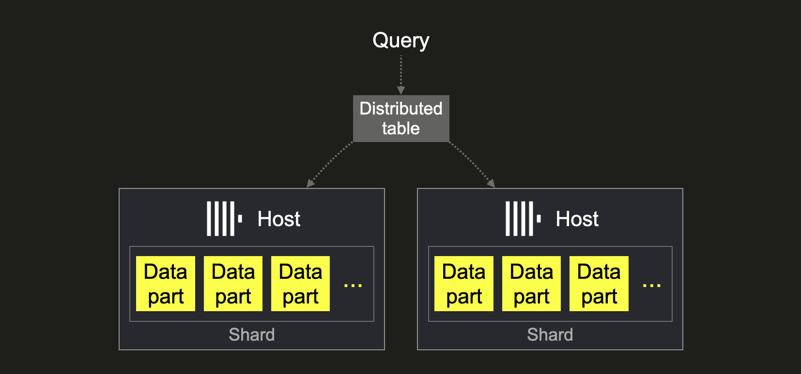
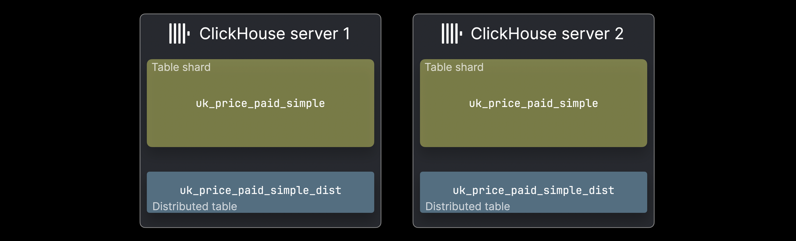

# Introduction

In many systems, we prefer to scale services horizontally rather than vertically, since scaling out is generally more cost-effective and flexible.

Scaling out means adding more machines or nodes in parallel to distribute the workload.
Scaling up means increasing the resources (CPU, RAM, etc.) of a single machine to handle more load. (Source)

In ClickHouse terminology, scaling out corresponds to sharding, where data is distributed across multiple nodes. To ensure high availability and fault tolerance, replicas are used alongside shards.

In this article, we will explore the concepts of clusters, replication, and sharding in ClickHouse.

## Sharding

In ClickHouse, when the volume of data and the number of requests increase beyond the capacity of a single node, we move toward horizontal scaling (scale-out) by introducing sharding.

Imagine a table stored on a single node (host1). As data grows, we add another node (host2) and split the data across these nodes. This process is called sharding, where each node stores only a portion of the total dataset.

How do we query sharded data?

There are two main approaches:

1. Query each shard directly

We can run SELECT queries on each node separately.

However, this approach requires us to:

- Know where each piece of data is stored
- Manually merge results from different nodes

This becomes complex and unmanageable at scale.

2. Use a Distributed Table

A better approach is to use a Distributed Table.

- It does not store actual data
- It acts as a routing layer (metadata-based)
- It automatically forwards queries to the correct shards
- It merges results from all shards transparently

  

This allows users to query the system as if it were a single table, while data is actually distributed across multiple nodes.

How do we insert data?

There are also two options for inserting data:

1. Direct insert into shards

We can insert data directly into each shard if:

- We know the shard structure
- We manage data distribution manually

2. Insert into Distributed Table (recommended)

We can insert data into the distributed table, and the system will:

- Use the sharding key
- Decide which shard should store each row
- Route data automatically to the correct node

This approach is simpler, safer, and more scalable.

  

## Note 

Remember: 

- Shard : Partition
- Distributed Table : Router
