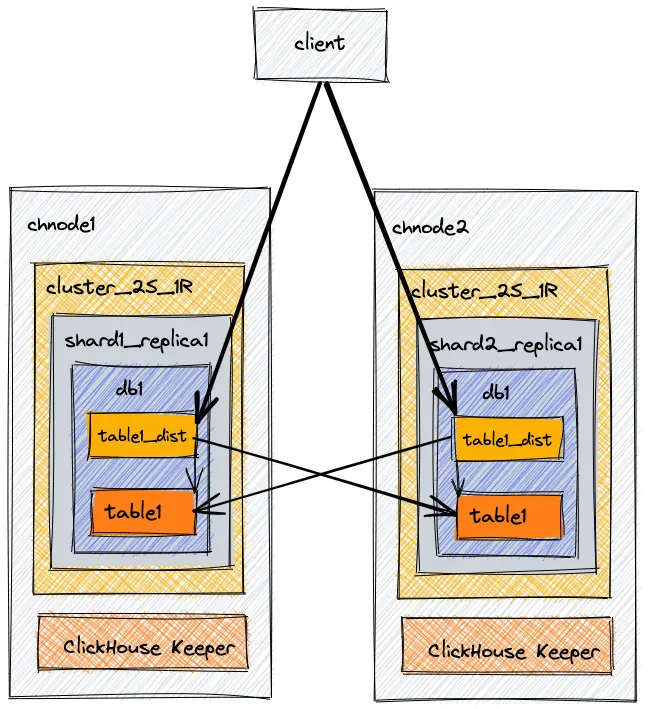
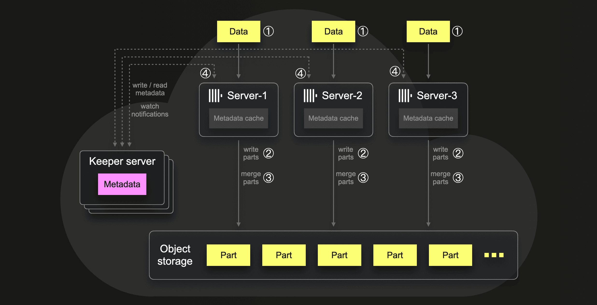

# Replication in ClickHouse

  

When building applications that rely on ClickHouse—especially for real-time or online analytics—high availability is critical. If a node goes down or a hardware failure occurs, we must ensure the system continues to operate without data loss or downtime.

This is where replication comes in.

Replication allows us to maintain multiple copies of the same data across different nodes, providing fault tolerance and ensuring continuous availability.

In ClickHouse, replication is supported only for tables based on the MergeTree engine family (e.g., ReplicatedMergeTree).

The coordination and management of replication are handled by ClickHouse Keeper, which is ClickHouse’s built-in alternative to ZooKeeper. It is fully compatible with ZooKeeper and is responsible for synchronizing replicas, managing metadata, and ensuring consistency across nodes.

  

